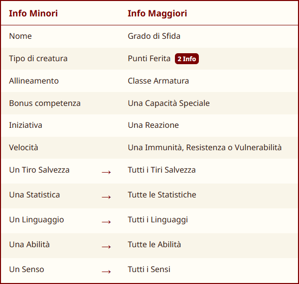
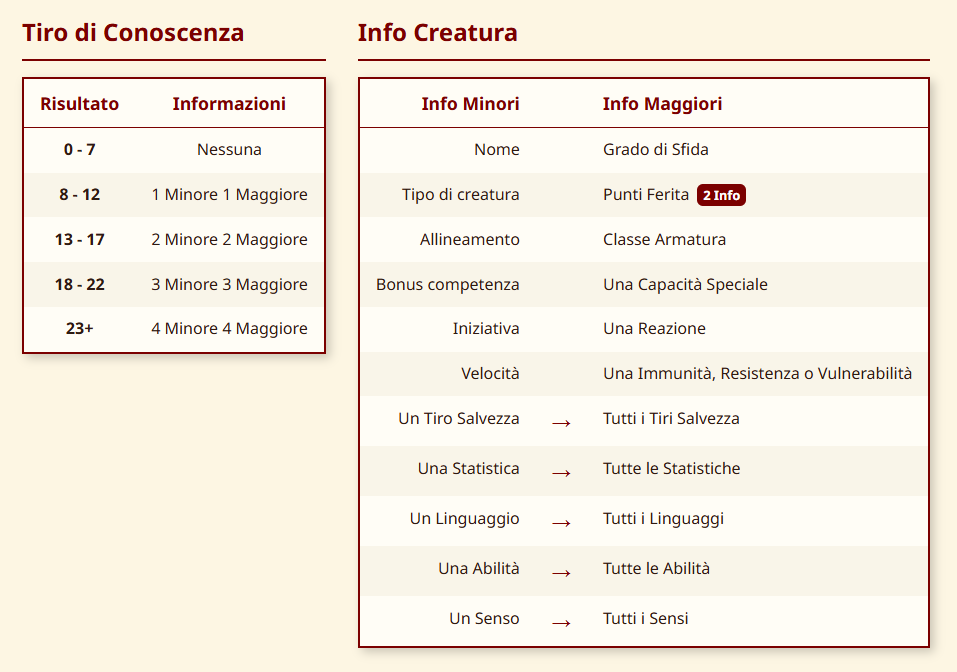

# Esplorazione

In questa sezione vengono introdotte le regole che governano l’esplorazione — il cuore della campagna.  
Ogni sessione rappresenta una vera e propria spedizione fuori dalla Base: i personaggi attraversano territori
pericolosi, affrontano sfide ambientali e interagiscono con creature e strutture misteriose.

Per gestire con chiarezza il tempo e le attività durante queste spedizioni, viene adottato un sistema chiamato
**Orologi**.

## Orologi

Gli **Orologi** sono l’unità di tempo standard utilizzata per gestire le **attività su scala lunga** durante una
spedizione.

- Un giorno intero (24 ore) è suddiviso in **6 Orologi**, e ciascun Orologio corrisponde a circa **4 ore**.
- Un Party ordinario può **viaggiare** per 2 orologi (8 ore), viaggiando ancora rischia di incorrere nei problemi della
  **Marcia Forzata**.
- Per terminare un **riposo lungo**, un PG ha bisogno di 2 orologi di sonno (8 ore).

All'inizio di ogni Orologio:

* Il DM si tira sulla **Tabella Eventi Casuali**.
* Ogni PG ha diritto a un **riposo breve**,
* Ogni PG sceglie quale **Attività** compiere: *Perlustrare, Cacciare, Allestire il Campo, Viaggiare esplorare un
  Dungeon etc...*

📌 **Nota Bene**: Gli Orologi non sono blocchi rigidi, ma una comoda astrazione per gestire le attività su lunghi
intervalli di tempo.

## Tabella Eventi Casuali

All’inizio di ogni Orologio, il DM tira 1d6 sulla **Tabella degli Eventi Casuali**, e decide quando introdurlo nel corso
dell’Orologio.  
La Tabella degli Eventi Casuali varia da Regione a Regione e si adattano al tono e ai pericoli locali.

| **Risultato** | **Descrizione**                                                                                                             |
|:-------------:|:----------------------------------------------------------------------------------------------------------------------------|
|      1–2      | **Evento ostile**: scontro con creature selvagge, un mostro minaccioso o una banda di nemici organizzati e malintenzionati. |
|      3–4      | **Evento incerto**: l’esito dipenderà dalle scelte e dai comportamenti dei personaggi.                                      |
|      5–6      | **Evento favorevole**: creature benevole, scoperte misteriose, zone magiche o momenti di quiete.                            |

## La Mappa

Il viaggio nelle terre selvagge si svolge su una **mappa esagonale**, in cui ogni esagono rappresenta una diversa
regione da esplorare.  
Ad ogni sessione, uno dei giocatori può assumere il ruolo di **Mappiere**: a lui verrà affidata una
**[Mappa Esagonale](https://drive.google.com/file/d/1GZSYOsyshpY3sY3MjcnoWKLRxMu5N-q_/view?usp=sharing)** su cui
annotare percorsi, scoperte e territori attraversati durante la spedizione.

📌 **Nota Bene**:  Ogni mappa è legata al **personaggio** che la compila, e sarà lui a decidere se condividerla con il
resto del POOL di giocatori oppure tenerla per sé.

## Viaggiare

Quando la squadra decide di mettersi in cammino, lascia l’esagono in cui si trova per entrare in uno adiacente.  
Questa attività richiede **circa un orologio** (4 ore).  
Durante il viaggio, i personaggi possono svolgere anche altre
*attività compatibili*, come: *Vigilare*, *Mappare*, *Foraggiare* o *Orientarsi*.

### Marcia Forzata

Una squadra può spingersi oltre i propri limiti camminando più a lungo del normale, ma a un prezzo.

- I Primi 2 Orologi vanno conteggiati normalmente, se il gruppo vuole spingersi al limite, gli orologi di viaggio
  successivi diventano **Marcia Forzata.**
- All’inizio di ogni orologio di marcia forzata, **ogni PG** deve superare un **TS di Costituzione** (CD = 10 + 4 per
  ogni orologio di marcia forzata già affrontato). Se il TS Fallisce, il PG subisce
  **[1 livello di Indebolimento](https://5e.tools/conditionsdiseases.html#exhaustion_xphb)**.
- Una volta iniziata la marcia forzata, **va portata a termine** fino al termine dell’orologio, indipendentemente
  dall’esito del tiro.

## Le Attività

Ecco qui l'elenco delle attività che un PG può svolgere durante un orologio:

Clicca su [Breviario delle Attività](https://drive.google.com/file/d/1-9lHhP-zaFkUjd5yXw8kSTufgrzaPeNB/view?usp=sharing)
per scaricarlo in formato pdf

|                   Attività                    | Descrizione                                                                                                                          |     Prova di      |
|:---------------------------------------------:|--------------------------------------------------------------------------------------------------------------------------------------|:-----------------:|
|          **[Viaggiare](#viaggiare)**          | Il gruppo lascia la Regione in cui si trova per entrare in un'altra Regione adiacente.                                               |      Nessuna      |
|           **[Vigilare](#vigilare)**           | Chi **Vigila** cerca di avvistare pericoli e nemici prima che siano loro ad avvistare il party.  *Si può fare mentre si viaggia* |  **Percezione**   |
|         **[Foraggiare](#foraggiare)**         | Chi **Foraggia** cerca cibo o acqua o altre risorse. *Si può fare mentre si viaggia*                                                 | **Sopravvivenza** |
|           **[Motivare](#motivare)**           | Chi **Motiva** da conforto e/o sprona i propri compagni. *Si può fare mentre si viaggia*                                             | **Intrattenere**  |
|         **[Orientarsi](#orientarsi)**         | Chi **si Orienta** evita che il party si perda. *Si può fare mentre si viaggia*                                                      | **Sopravvivenza** |
|           **[Cacciare](#cacciare)**           | Chi **Caccia** cerca la tana o crea una trappola per una specifica creatura che popolano la regione.                                 | **Sopravvivenza** |
|        **[Perlustrare](#perlustrare)**        | Chi **Perlustra** controlla che tipi di creature abitano una data regione.                                                           |    **Natura**     |
| **[Estrarre Materiali](#estrarre-materiali)** | Chi **Estrae Material**e dal cadavere di un mostro o dal terreno.                                                                    |    **Natura**     |
|    **[Allestire Campo](#allestire-campo)**    | Chi **Allestisce il campo** prendendo le dovute precauzioni                                                                          | **Sopravvivenza** |

📌 **Nota Bene**:

* Un PG può impegnarsi solo in un'attività alla volta.
* Queste attività possono essere aiutate da chi abbia la competenza nell'abilità richiesta.
* Le attività *Cacciare, Perlustrare, Estrarre Materiale, Allestire il Campo* non si possono fare mentre si viaggia

### Vigilare

Un PG che **Vigila** tenta di avvistare i nemici prima che siano loro a vedere il gruppo.  
Si effettua una **Prova di Percezione** contrapposta alla **Prova di Furtività** dei nemici.

- Se ha successo → Il gruppo ottiene un **Round a Sorpresa**.
- Se fallisce → Si tira iniziativa. Il DM usa la **Percezione Passiva** dei PG per determinare chi è sorpreso.

Un altro PG può aiutare solo se ha competenza in **Percezione**.  
Se nessuno vigila, si confronta direttamente **Furtività** dei nemici con **Percezione Passiva** dei PG.

### Foraggiare

Chi **Foraggia** sceglie se cercare **cibo** o **acqua**, poi effettua una **Prova di Sopravvivenza** (CD variabile per
Bioma).

- **Successo** → Le razioni del tipo cercato **aumentano di 1**
- **Fallimento di 5 o meno** → Le razioni del tipo cercato **restano invariate**
- **Fallimento di più di 5** → Le razioni del tipo cercato **diminuiscono di 1**

Un altro PG può aiutare solo se ha **competenza in Sopravvivenza**.  
Se **nessuno foraggia** per un certo tipo di risorsa, le razioni di quel tipo **diminuiscono di 1**.

### Motivare

[Rivedere]

### Orientarsi

Un PG può orientarsi in due modi:

- **A Punti di Riferimento** → Se la destinazione è visibile  (es. *seguire un fiume*, *costeggiare una
  scogliera*, ...) **non serve tirare**.
- **In Modo Direzionale** → Se non c’è un riferimento visibile, serve una **Prova di Sopravvivenza** (CD variabile per
  Bioma).

💢 **Fallimento** (in entrambi i casi il DM tira **1d12** segretamente):

- di 5 o meno → Il party va in **fuoristrada leggero**.
- di più di 5 → Il party va in **fuoristrada pesante**.

Un altro PG può aiutare solo se ha competenza in **Sopravvivenza**.

### Cacciare

Chi **Caccia** sceglie una creatura nota della regione, poi effettua una **Prova di Sopravvivenza** (CD variabile per
Creatura).

- **Successo** → trova la **tana** o prepara una **trappola** per quella creatura.
- **Fallimento di più di 5** → attira la creatura su di sé.

Un altro PG può aiutare solo se ha competenza in **Sopravvivenza**.  
⚠️ Non si può **Cacciare durante il viaggio**.

### Perlustrare

Chi Perlustra analizza un'intera Regione per identificare le creature che la abitano, cercando tracce o segni della loro
presenza, effettuando una prova di **Prova di Natura** (CD variabile per Regione).

- **Successo** → si scopre quali creature popolano la regione (ma **non** le si incontra direttamente).

Un altro PG può aiutare solo se ha competenza in **Sopravvivenza**.   
⚠️ Non si può **Perlustrare durante il viaggio**.

### Estrarre Materiali

[Rivedere]

Un PG che **Estrae materiale** può recuperarli dal cadavere dei mostri appena sconfitti oppure dall'**ambiente**
circostante.  
*\[Esistono regole specifiche per effettuare queste azioni ma ho deciso di non riportarle qui per evitare di appesantire
il regolamento e non sono una parte sulla quale il gioco vuole focalizzarsi, cosa confermata dai playtest\]*

### Allestire Campo

[Rivedere]

Farsi descrivere dai PG come vogliono allestire il campo, precisare se intendono fare qualcosa di particolare
come sistemi di sicurezza o occultamenti specifici, valutare se occorre richiedere una prova.

## Razioni di Cibo e d'Acqua

[Rivedere]

Al termine di ogni Orologio di veglia il gruppo deve mangiare una **Razione di Cibo** e bere **una Razione d'Acqua**.   
Con **Razione di Cibo** e **Razione d'Acqua** si intendono unità capaci di sfamare e dissetare l'intero gruppo per un
orologio.

Se il gruppo non ha unità di cibo da poter consumare ogni membro della squadra dovrà superare un **TS COS CD 15** o
subire un livello di Indebolimento. Lo stesso TS dovrà essere eseguito anche in assenza di unità d'acqua.

## Riposo Lungo e Turni di Guardia

Un **Riposo Lungo** richiede **2 Orologi**, suddivisi in 6 ore di sonno e 2 ore di attività leggera.

- Con **4 PG**, ognuno può vigilare per 2 ore, coprendo le 8 ore con **4 turni singoli**.
- Poiché il riposo copre **2 Orologi**, si devono tirare **2 Eventi Casuali**  
  Tirare **1d2** per determinare in quale turno avviene e **chi è sveglio**.

⚠️ **Gli Elfi** in trance contano doppio e possono coprire **due turni da soli**.

## Tiri Conoscenza

Effettuare un **Tiro di Conoscenza** per ottenere informazioni su una creatura è un [**Azione**].  
Si tira su Arcana, Natura, Religione o Storia in base al nemico, e si confronta il risultato con la seguente tabella.

|  Risultato  |        Esito        |
|:-----------:|:-------------------:|
|  **0 - 7**  |      Zero Info      |
| **8 - 12**  | 1 Minore 1 Maggiore |
| **13 - 17** | 2 Minore 2 Maggiore |
| **18 - 22** | 3 Minore 3 Maggiore |
|   **23+**   | 4 Minore 4 Maggiore |

