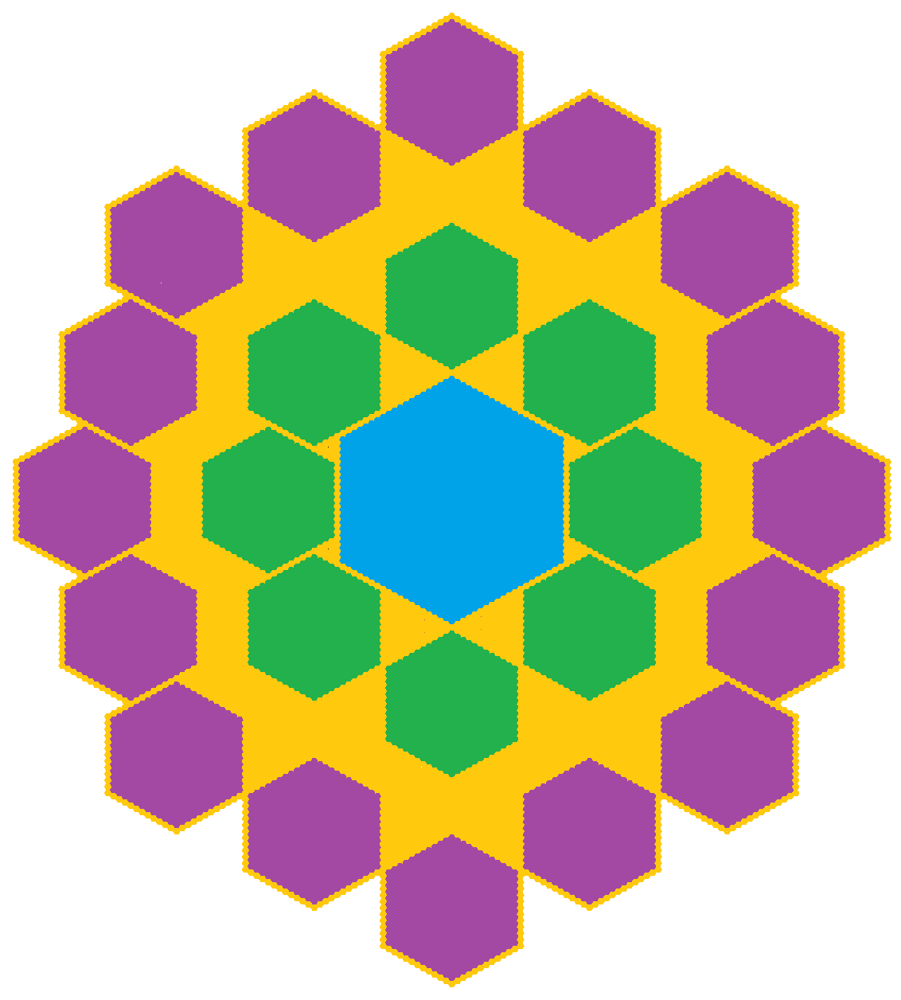
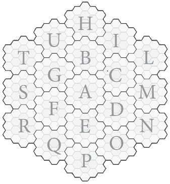

# Struttura Finemondo

Il Finemondo è un mondo piatto ed è costituito da 2 cerchia concentriche
di Macroaree come *rappresentato nella figura
sottostante.*

- Gli Esagoni Viola, sono la fila delle 16 Macro-aree esterne, una per ogni piano esterno della grande Ruota.
- Gli esagoni Verdi sono la fila delle 8 Macro-aree interne, una per ogni allineamento (Tranne NN)
- L’esagono Blu al centro è dove risiede la Forza Arcana (NN)
- La parte Gialla è la Cieca Eternità che collega le Macro-aree.

## Il Centro del Fine Mondo

Al centro della Macro-Area centrale c'è una grande **Torre Azzurra**dove risiede la **Gemma Rinata del Tempo** da cui si
sprigiona la **Forza Arcana** che rapisce i giocatori

La torre ha un’architettura in stile Magitek/Numenera/Eberron.

Attorno alla **Torre Azzurra** partono 8 vettori in 8 direzioni diverse, a tot km di distanza su ognuno di questi
vettori è costruito un **Tempio del Tempo Perduto**, ve n’è uno per ogni Macro-Area.

## Le Macro-Aree

Per Macro-Area si intende un'Area esplorabile costituita come nella figura sotto.

Ogni Macro Area è racchiusa dentro una **Bolla Contenitiva**, per questa ragione si può intendere il Finemondo come un
reticolo di Bolle Contenitive.

Al centro di ogni Macro Area vi è un Tempio del Tempo Perduto circondato da una **Barriera Protettiva.**

I giocatori quando vengono rapiti dalla Forza Arcana vengono scaraventati in un Tempio del Tempo Perduto.

### Barriere Protettive

Barriere di energia temporale più piccole che proteggono gli esagoni dove risiede il Tempio del Tempo Perduto.

Sia il Palazzo del cristallo che i templi del tempio sono circondati da una Barriera Protettiva che li protegge dal caos
del Finemondo.

### Confini della Macro Area

Se i PG arrivano ai bordi di una Macro-Area troveranno il vuoto assoluto, "La cieca Eternità", Il "Reame Remoto".

Guardando nel vuoto i PG potranno vedere degli Eldrazi o dei mostri simili a Cthulhu che vagano nel nulla.

Se i PG si affacciano sulla cieca Eternità saranno visti dai mostri:

- Quelli minori li attaccheranno per sfamarsi
- Quelli maggiori non vedono i PG come delle minacce e li lasceranno in pace.

### Perché ai confini c'è la Cieca Eternità?

I PG sono connessi al loro **Tempio** il quale a sua volta è connesso alla propria **Bolla Contenitiva.**

La **Bolla Contenitiva** non permette ai PG di vedere cosa c'è al di là di essa. La terra esiste al di là della bolla,
ma i PG non essendo connessi a quella terra se oltrepassassero il confine finirebbero sfasati e cadrebbero nella cieca
eternità. L'unico modo per varcare il confine è sincronizzare la propria **Bolla Contenitiva** con una **Bolla
Contenitiva** contigua. È come se il Finemondo fosse costituito da un reticolo di **Bolle Contenitive** che permette ai
PG di essere sincronizzati con la propria bolla contenitiva. Un **Firewall** che li protegge dai pericoli della cieca
eternità.

## Autoctoni e Piovuti VS Bolla Contenitive

Gli **autoctoni** non hanno bisogno di essere sincronizzati con le **Bolle Contenitive** e quindi possono attraversarle.
Questo perché il loro DNA è già sincronizzato con il Finemondo, dato che il corpo è formato da atomi che derivano dal
Finemondo. Anche i **Piovuti dal cielo** sono immuni agli effetti della **Bolla Contenitiva** in quanto risucchiati
dalle voragini della **Cieca Eternità**, la quale ha ricombinato i loro Atomi.

Questo a gli **Eletti** non succede perché loro sono arrivati nel Finemondo tramite un metodo non convenzionale ovvero
sono stati richiamati dalla **Forza Arcana,** mentre la maggior parte delle persone che abita il Finemondo è o Autoctona
o Piovuta dal cielo perché divorata da una voragine sul piano materiale.

## Se 2 Bolle Contenitive si uniscono:

Se I PG compiono determinate missioni e recupereranno determinati oggetti la **Bolla Contenitiva** si può espandere e
unirsi ad una Bolla Contenitiva contigua.
Fatte queste missioni si apre una strada che se seguitata li porta ad un altro Tempio del Tempo Perduto.

Gli **autoctoni** e i **piovuti** sono inerti alle bolle temporali e non si accorgono di eventuali modifiche.

Gli **Eletti** di un Tempio del Tempo Perduto possono entrare in un altro Tempio del Tempo Perduto solo se posseggono il
talismano per accedervi. Gli Eletti del nuovo tempio potrebbero essere ostili.