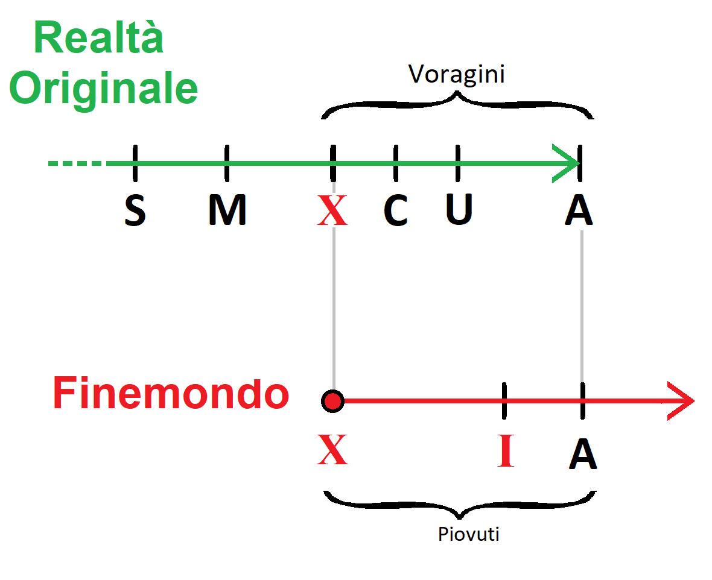

# Macro Trama

## In breve

Il mondo dove i PG andranno a giocare questa campagna è una **singolarità temporale** posta alla fine dei tempi del
multiverso. Milioni di anni nel futuro per motivi ancora ignoti gli universi collassarono gli uni sugli altri, e il
tessuto temporale iniziò a sbriciolarsi.

I giocatori, di qualunque ambientazione e di qualunque tempo, verranno rapiti da una **forza magica sconosciuta** che li
porterà nel "**Fine-Mondo**". Questa forza rapisce i PG nella speranza che riescano a riparare il tempo. Ma i PG tutto
questo non lo sanno, sanno solo di essere stati rapiti e catapultati in un mondo che non è il loro. Tutto il resto lo
impareranno viaggiando tra le rovine dei vari universi collassati tra di loro. Una **scelta cruciale** che i PG dovranno
prendere sarà se ricostruire il tempo oppure distruggerlo del tutto per farlo ripartire.

## Estesa

Fin dall'alba dei tempi c'è sempre stato qualcuno particolarmente ossessionato dal concetto del tempo. Chi ha provato ad
ingannarlo e chi ha provato a governarlo.

Con il passare delle ere si è formata un'organizzazione segreta con l'obiettivo del dominio del tempo. Imparare le sue
leggi, i suoi segreti e poterlo manipolare a piacimento. Dopo molti anni e dopo innumerevoli sacrifici costoro
riuscirono a strappare una parte del tempo ed imbrigliarlo in una **Gemma**.

Questo potere nelle loro mani cambiò radicalmente il destino del mondo. Per innumerevoli anni questi uomini ricoprirono
le cariche più importanti della società, muovendosi nell'ombra e arricchendosi a dismisura.

### La Creazione delle Piccole Gemme

Erano riusciti ad imbrigliare una parte del tempo all'interno di una **Grande Gemma**, che sprigionava una luce blu
pulsante. *La gemma era viva ma questo loro non lo sapevano*. Passarono molti anni e dopo innumerevoli esperimenti sulla
gemma, riuscirono a frammentare il suo potere in tante altre gemme più piccole e dai poteri più limitati le quali furono
divise tra i membri dell'organizzazione. Loro non lo sapevano ma così facendo diedero alla luce tanti piccoli Avatar del
Tempo, ognuno dei quali imprigionato all'interno di queste **Piccole Gemme** e tutti quanti bramosi di vendetta. Poi
iniziarono ad esserci i primi malfunzionamenti.

### Le Voragini

Per molti anni questi uomini cercarono di arginare i danni causati dai malfunzionamenti

C'era chi andava a dire in giro che il tempo era impazzito e voleva vendicarsi sugli uomini. Chi andava a predicare
questa eresia veniva messo al rogo come eretico. Ma questi non erano né pazzi né eretici, erano dei visionari e avevano
ragione. Ma poi questi malfunzionamenti si fecero sempre più gravi fino a che si aprirono le prime **Voragini** dalle
quali uscirono
gli [Eldrazi](https://www.google.com/search?q=Eldrazi&rlz=1C1CHBF_itIT918IT919&sxsrf=ALiCzsY7VoLvcjkYTRtYVwA5f8qgPm1qfA:1660120882981&source=lnms&tbm=isch&sa=X&ved=2ahUKEwi5hY6c8Lv5AhVEiv0HHbNMBywQ_AUoAXoECAIQAw&biw=1366&bih=625&dpr=1),
i più fortunati venivano risucchiati dalle voragini e spediti
nel [Finemondo](https://docs.google.com/document/d/12q_kbx_nq69tsjqRfSlPmmNfVyUc7Wvf/edit#heading=h.5ilxe8ph362j) mentre
i più sfortunati venivano divorati dagli **Eldrazi**.

Le Voragini si espandono a chiazze nel piano materiale. Se ne apre una grossa e poi pian piano intorno se ne aprono di
secondarie.

### La Crociata Temporale

Con l'apertura delle prime voragini l'esistenza di questa organizzazione segreta venne allo scoperto, ci fu un assalto
alla loro base segreta dove molti di loro vennero uccisi e gli altri si diedero alla fuga, la **Grande Gemma** venne
colpita e ridotta in frantumi.

Molti segreti dell'organizzazione vennero svelati, e si iniziò a dar credito all'idea che il Tempo si stava risvegliando
manifestando la propria volontà! E qui ebbe inizio la **Prima crociata temporale:**

Da una parte c'era chi voleva sistemare il tempo sfilacciato richiudendo le voragini e chi dall’altra parte voleva
distruggere il tempo per farlo ripartire.

### Il Protocollo Ultimo

Negli ultimi anni, prima che il mondo finisse, dei **Ribelli** appartenenti ad entrambe le 2 fazioni si allearono
cercando di attivare quello che passò alla storia come **Protocollo Ultimo**. Vennero aiutati dalle **Piccole Gemme** e
dai pochi frammenti della **Grande Gemma** che riuscirono a recuperare. Questi ribelli seguendo le istruzioni delle
gemme misero in atto un complesso rituale di magia e tecnologia che passò alla storia come **Protocollo Ultimo.** Con
questo rituale cercarono di rifondere assieme le **Piccole Gemme** del tempo e i frammenti della **Grande Gemma** per
generare una nuova pietra che prese il nome di **Gemma Del tempo Rinato,** con la quale avrebbero sistemato gli squarci
nel tempo. Si erano radunati a **Sigil** dove costruirono un potente macchinario che li avrebbe aiutati. Ma il rituale
finì in malo modo a causa dell'Eterno N1 che li tradì. Si aprì una spaventosa voragine, ci fu una tremenda battaglia, ma
alla fine **Sigil**, la **Gemma del Tempo Rinata** e tutti i **Ribelli** vennero inghiottiti per venire scaraventati nel
Finemondo.

### Il Finemondo

Il Finemondo è il termine provvisorio con cui ci si riferisce all'ambientazione da esplorare con le WM; e consiste in
una realtà alternativa fuori dalla [Grande Ruota](https://dungeonsanddragons.fandom.com/it/wiki/Multiverso).

Questa realtà è costituita da tutte le varie cose, persone, città, mari e montagne inghiottite dalle Voragini,
praticamente il Finemondo è la cloaca delle Voragini.

All’inizio il mondo dovrebbe apparire come [Numenera](https://it.wikipedia.org/wiki/Numenera), un mondo simile a quello
dove hanno vissuto i PG ma proiettato un miliardo di anni nel futuro, una terra costellata da enormi rovine delle
innumerevoli civiltà che si sono susseguite in questo miliardo di anni. Poi man mano che esplorano i PG arriveranno a
scoprire la storia e la trama che sta dietro alla Genesi del Finemondo.

### Nascita della Forza Arcana

La forza Arcana non è nient'altro che lo **Spirito del Tempo Rinato** intrappolato all’interno della **Gemma Del tempo
Rinato,** la quale si ritrova dispersa al centro del Finemondo. La forza arcana è come un fuoco fatuo senziente di
colore blu.

La Gemma Del tempo Rinato riesce a leggere il passato, il presente e il futuro, e per questo motivo sceglie e richiama a
sé gli Eletti (I PG) strappandoli alla loro realtà e spedendoli nel Finemondo. Ovviamente non ha la certezza che siano
quelli giusti, ma sono gli uomini migliori su cui puntare per ripristinare il corretto scorrere del tempo ed evitare la
cancellazione della realtà originale.

#### Focus - Forza arcana

- Rapisce i PG da altre epoche e da altri mondi per portarli ne Finemondo.
- E' stata attivata dai Ribelli durante la Crociata Temporale come Protocollo Ultimo.
- Risiede al centro del Finemondo.
- Vuole salvare il mondo.
- La forza è buona.
- È una entita pensante, è lo Spirito Rinato del Tempo intrappolato nella Gemma Rinata del Tempo.
- Risiede al centro del fine mondo in una torre Azzurra in stile Numenera/Eberron.
- La forza parla agli Eterni. Ma gli Eterni sanno solo che è una Forza Arcana e non sanno esattamente cosa sia.
- Conosciuta anche come: Forza Arcana, Forza Motrice, Forza Ultima, Forza Ancestrale, Fuoco fatuo, Forza blu

## Schema

- **S = Strappo**
  Momento in cui le società segrete riescono a strappare una parte del tempo dalla realtà ed imbrigliarlo in una
  **gemma**.

- **M = Malfunzionamenti Temporali**
  Momento in cui il tessuto spaziotemporale inizia a dare i primi cenni di cedimento.

- **X = Singolarità Temporale**
  Nascita del Finemondo. Nella realtà originale si aprono le prime piccole **Voragini**, le quali iniziano a rubare
  materia che precipita nel Finemondo.
  Coesiste in entrambe le linee

- **C = Crociata Temporale**
  Momento in cui il tempo è palesemente fuori controllo e scoppia la crociata temporale.

- **U = Protocollo Ultimo**
  …

- **A = Annichilimento Realtà Originale.**
  Coesiste in entrambe le linee, Momento in cui si aprirà un'unica immensa voragine che trasporterà tutta la realtà
  originale nel Finemondo .

- **I = Iniziano ad arrivare i PG nel Finemondo**
  …