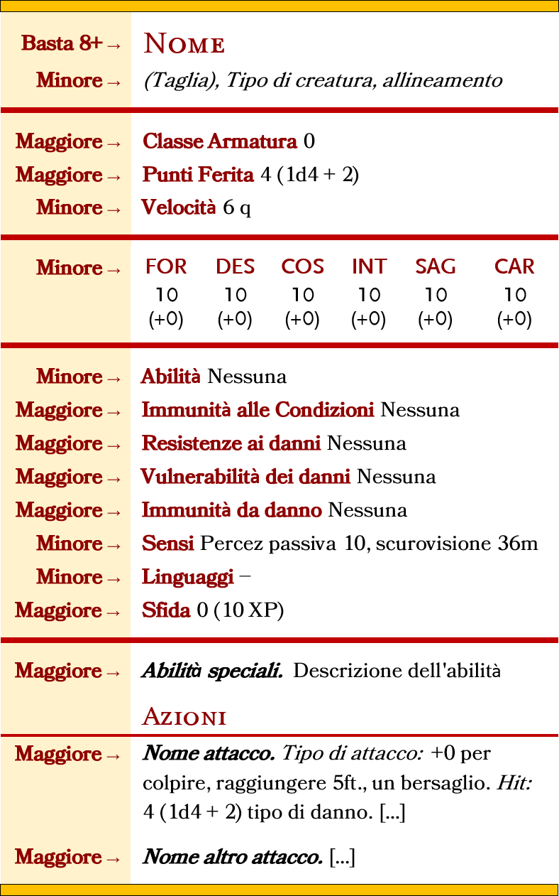

# Esplorazione

## Orologi

Gli "**orologi**" sono l'unità di tempo standard utilizzata per le **attività** nel lungo periodo. In un normale giorno
di 24 ore, ci sono 6 orologi, ciascuno equivale a circa 4 ore.

* Un Party ordinario può **viaggiare** per 2 orologi (8 ore), viaggiando ancora rischia di incorrere nei problemi della
  Marcia Forzata.
* Per terminare un **riposo lungo**, un personaggio ha bisogno di 2 orologi di sonno (8 ore).
* All'inizio di ogni Orologio ogni PG ha diritto a un **riposo breve**, dopodichè sceglie quale **Attività** compiere,
  Perlustrare, Cacciare, Allestire il Campo, Viaggiare esplorare un Dungeon etc...
* Alla fine di Ogni Orologio si tira sulla Tabella Eventi Casuali.

NB: Non pensare agli orologi come blocchi rigidi, ma sono solo una scorciatoia utile per misurare le attività su periodi
di tempo più lunghi. Infatti, una missione non dura un quantitativo di orologi definito a priori, ma la sua durata varia
in base alle necessità del tavolo.

## Tabella Eventi Casuali

Alla fine di ogni Orologio il DM tira un 1d6 sulla Tabella degli Eventi Casuali e comunica il risultato ai PG. I
risultati possono essere Pericoli del Territorio, Mostri feroci, Incontri pacifici etc Gli esiti cambiano da Regione a
Regione.

## La Mappa

Il viaggio nelle terre selvagge è visualizzabile mediante una mappa esagonale dove ad ogni esagono corrisponde una
diversa regione da esplorare.  
Ad ogni giocatore che in sessione vuole ricoprire il ruolo di Mappiere verrà lasciata in custodia una **[Mappa Esagonale
](https://drive.google.com/drive/folders/1FbsKQic-0DrDFY8vyqJI8_ShbFBdV3oh)** da utilizzare per riportare i luoghi e le
regioni esplorate durante le sue spedizioni.

NB: ogni mappa è di proprietà del PG Mappiere, e sarà sua discrezione se divulgarla al resto del POOL di giocatori o
tenersela per sè.

## Viaggiare

Quando il gruppo di spedizione decide di mettersi in viaggio lascia l'esagono in cui si trova per entrare in un altro
esagono ad esso contiguo. Compiere questa attività richiede tendenzialmente un orologio. Durante il viaggio si possono
fare altre **attività** come: Vigilare, Mappare, Foraggiare e Orientarsi.

### Marcia Forzata

La **Marcia Forzata** ha le seguenti regole:

* I Primi 2 Orologi vanno conteggiati normalmente, se il gruppo vuole spingersi al limite, gli orologi di viaggio
  successivi diventano **Marcia Forzata.**
* All'inizio di ogni **Orologio** di viaggio in marcia forzata ogni PG deve superare un TS COS dove la CD è 10 \+ 4 per
  ogni **Orologio** di marcia forzata. Se il TS Fallisce, il PG riceve un liv di indebolimento.

NB: Una volta dichiarata la marcia forzata, ed effettuato il TS COS, la marcia forzata deve essere protratta fino alla
fine dell'orologio indipendentemente dall'esito del TS.

## Cosa fare in un Orologio?

Clicca su [Breviario delle Attività](https://drive.google.com/drive/folders/1FbsKQic-0DrDFY8vyqJI8_ShbFBdV3oh) per
scaricarlo in formato pdf

|        Attività        | Descrizione                                                                                                                                |                        Occorre una Prova di                         |
|:----------------------:|--------------------------------------------------------------------------------------------------------------------------------------------|:-------------------------------------------------------------------:|
|     **Viaggiare**      | Il gruppo lascia la Regione in cui si trova per entrare in un'altra Regione ad essa contigua.                                              |                               Nessuna                               |
|      **Vigilare**      | Chi **Vigila** si occupa di avvistare pericoli e nemici prima che siano loro ad avvistare il party Si può fare mentre si viaggia           |                           **Percezione**                            |
|     **Foraggiare**     | Chi **Foraggia** cerca cibo o acqua o altre risorse.  Si può fare mentre si viaggia                                                        |                          **Sopravvivenza**                          |
|      **Motivare**      | Chi **Motiva** da conforto e/o sprona i propri compagni di squadra Si può fare mentre si viaggia                                           |                          **Intrattenere**                           |
|     **Orientarsi**     | Chi **si Orienta** evita che il party si perda. L'Orientamento può essere Direzionale o per Punti di Riferimento Da fare mentre si viaggia | Orientarsi per Riferimento **Nessuna** altrimenti **Sopravvivenza** |
|      **Cacciare**      | Chi **Caccia** è limitato alle creature che sa che popolano la regione. Superando la prova il PG trova la tana della creatura.             |                          **Sopravvivenza**                          |
|    **Perlustrare**     | Chi **Perlustra** controlla che tipi di creature abitano una data regione.                                                                 |                             **Natura**                              |
| **Estrarre Materiale** | Chi **Estrae Material**e dal cadavere di un mostro o dal terreno.                                                                          |                             **Natura**                              |
| **Allestire il Campo** | Chi **Allestisce il campo** prendendo le dovute precauzioni                                                                                |                          **Sopravvivenza**                          |

* Un PG può impegnarsi solo in un'attività alla volta.
* Queste attività possono essere aiutate da chi abbia la competenza nell'abilit� richiesta.
* Le attività "Cacciare, Perlustrare, Estrarre Materiale, Allestire il Campo" non si possono fare mentre
  si viaggia

### Vigilare

Un PG che **Vigila** si occupa di avvistare pericoli e nemici prima che siano loro ad avvistare il gruppo.  
Per **Vigilare** occorre impiegare il tempo di un Orologio e superare una **Prova di Percezione** contro una **Prova di
Furtività** dei possibili nemici.  
Il successo nel tiro di **Percezione** significa che la Vedetta ha avvistato i possibili nemici. In questo caso il
gruppo ha tempo di prepararsi e godrà degli effetti di un Round a Sorpresa.   
Nel caso in cui il tiro di **Percezione** fosse un fallimento, si dovrà tirare iniziativa. A questo punto il DM
confronta la percezione passiva dei PG contro la furtività dei nemici, e dirà quali PG saranno sorpresi nel primo turno
di iniziativa.

1. Un altro PG può aiutare chi **Vigila** a patto che possegga pure lui la competenza in Percezione.

NB: Qualora ci fossero dei nemici e non ci fosse nessuno a vigilare il DM confronta Furtività VS Percezione passiva, e
dirà quali PG saranno sorpresi nel primo turno di iniziativa.

### Foraggiamento

Chi **Foraggia** per prima cosa deve scegliere se foraggiare per cibo o per acqua, dopodichè deve superare una prova di
Sopravvivenza, la cui CD varia in base al Bioma della Regione, dopodichè:

* Se la prova è superata le **Razioni** del tipo cercato presenti nella casa comune anzichè diminuire di 1 salgono di 1
* Se la prova è fallita di 5 o meno, le **Razioni** del tipo cercato presenti nella casa comune anzichè diminuire di 1
  rimarranno invariate.
* Se la prova è fallita di più di 5, le **Razioni** del tipo cercato presenti nella casa comune diminuiscono di 1\.
* Un altro PG può aiutare chi foraggia a patto che possegga pure lui la competenza in Sopravvivenza.

### Motivare

TODO

### Orientarsi

Un PG che **si orienta** può scegliere se

1. Orientarsi a Punti di Riferimento, oppure
2. Orientarsi in Modo Direzionale.

#### Orientarsi a Punti di Riferimento

Per scegliere questa modalità occorre una chiara e visibile destinazione all'orizzonte. Finchè il punto di riferimento è
chiaramente visibile, non occorre fare tiri di orientamento. Al massimo un paio di tiri per individuare il punto di
riferimento.   
*Esempio: il corso di un fiume, una scogliera, una costa, o la cresta di una montagna.*

#### Orientamento Direzionale

Solitamente si sceglie questa modalità quando non si dispone di un visibile punto di riferimento. La Guida deve
scegliere una direzione in base al suo senso dell'orientamento e dopodichè deve effettuare un tiro di Sopravvivenza. La
Base della CD varia in base al Bioma della Regione.

#### Perdersi

Se la Guida fallisce il tiro di 5 o meno, il party va **in leggero fuoristrada.**  Se la Guida fallisce il tiro di più
di 5, il party è andato **significativamente fuoristrada.**   
Il DM tira segretamente 1d12 e consulta le sue tabelle.

### Cacciare

Un PG che **Caccia** può cacciare solo le creature che sa con certezza che vivono nella regione.   
Per **cacciare** occorre spendere il tempo di un orologio e superare una **prova di Sopravvivenza** contro la CD della
creatura. Se la prova viene superata il PG trova la tana della creatura.

* Un altro PG può aiutare chi **Caccia** a patto che possegga pure lui la competenza in Sopravvivenza
* I PG non possono cacciare durante il viaggio

### Perlustrazione

Un PG che **Perlustra** controlla un'intera Regione per determinare quali tipi di creature la abitano.  
Per **perlustrare** occorre impiegare il tempo di un Orologio e superare una **prova di Natura.**  
Il successo nel tiro di Perlustrazione non implica che il PG abbia trovato la creatura in questione ma indica che è
riuscito a trovare prove della presenza di tale creatura.

* Un altro PG può aiutare chi **perlustra** a patto che possegga pure lui la competenza in Sopravvivenza.
* I PG non possono Perlustrare durante il viaggio.

### Estrarre Materiali

Un PG che **Estrae materiale** può recuperarli dal cadavere dei mostri appena sconfitti oppure dall'**ambiente**
circostante.  
*\[Esistono regole specifiche per effettuare queste azioni ma ho deciso di non riportarle qui per evitare di appesantire
il regolamento e non sono una parte sulla quale il gioco vuole focalizzarsi, cosa confermata dai playtest\]*

### Allestire Campo

[Rivedere] Farsi descrivere dai PG come vogliono allestire il campo, precisare se intendono fare qualcosa di particolare
come sistemi di sicurezza o occultamenti specifici, valutare se occorre richiedere una prova.

### Razioni di Cibo e d'Acqua

Al termine di ogni Orologio di veglia il gruppo deve mangiare una **Razione di Cibo** e bere **una Razione d'Acqua**.   
Con **Razione di Cibo** e **Razione d'Acqua** si intendono unità capaci di sfamare e dissetare l'intero gruppo per un
orologio.

Se il gruppo non ha unità di cibo da poter consumare ogni membro della squadra dovrà superare un **TS COS CD 15** o
subire un livello di Indebolimento. Lo stesso TS dovrà essere eseguito anche in assenza di unità d'acqua.

### Turni di Guardia

Per fare un **Riposo Lungo** occorrono 6 ore di sonno e 2 ore di attività leggere, per tanto l'unico modo con cui avere
turni di guardia (Singoli) è avere una squadra di 4 PG dove ognuno dei quali spende 2 Ore (mezzo-orologio) a **Vigilare
**.
Tirare 1d4 per decidere in quale mezzo-orologio di guardia si trovano i possibili nemici. Per avere turni di guardia
doppi occorrono 8 PG. Gli Elfi grazie alla loro trance contano doppio quindi possono fare doppio turno di guardia.

### Tiri Conoscenza

[Rivedere] Effettuare un tiro di conoscenza per scoprire di più su un nemico è un \[Azione\]. Si tira su Arcana, Natura,
Religione o Storia in base al nemico, e si confronta il risultato con la seguente tabella. è sufficiente un tiro uguale
o superiore a 8 per scoprire automaticamente il nome della creatura. La taglia è evidente di per sè, non occorre un tiro
di conoscenza per scoprirla.

|    Risultato    |        Esito        |
|:---------------:|:-------------------:|
|    **X < 7**    |      Zero Info      |
| **8 < X < 12**  | 1 Minore 1 Maggiore |
| **13 < X < 17** | 2 Minore 2 Maggiore |
| **18 < X < 22** | 3 Minore 3 Maggiore |
|   **X < 23**    | 4 Minore 4 Maggiore |

